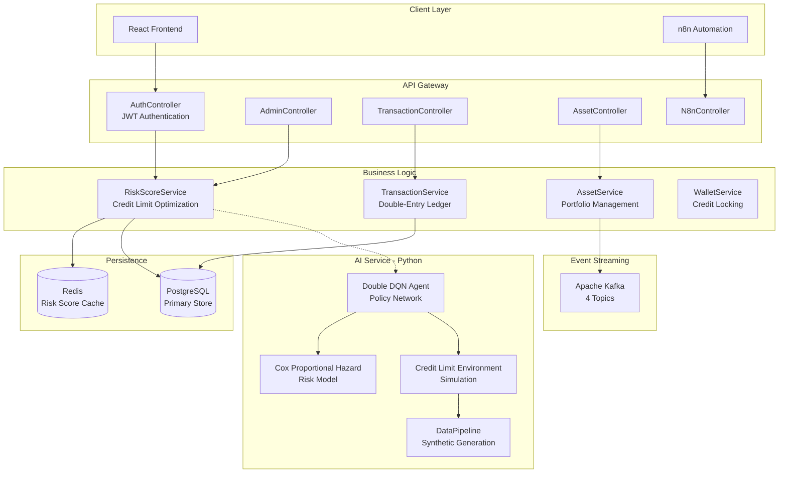
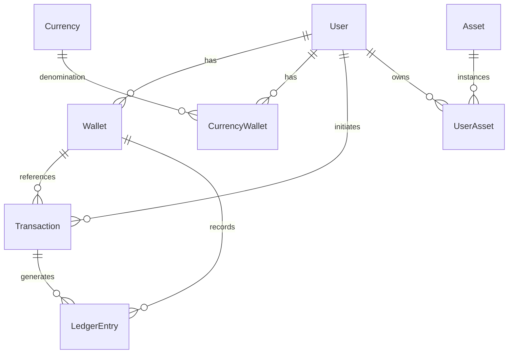

# Advanzia AutoLend Backend - Technical Documentation

## 🎯 Epic: Autonomous Lending Systems (FIN-73)

> **User Story**: "As a Credit Card Issuer, I want to dynamically adjust user credit limits to maximize spend while minimizing defaults."

---

## ✅ Definition of Done - Fulfilled Requirements

| Requirement | Target | Implementation Status |
|-------------|--------|----------------------|
| **SLA: Decision Latency** | < 1 second | ✅ Redis caching (15min TTL) enables sub-second decisions |
| **Throughput** | 5,000 req/min peak | ✅ Async Kafka event streaming + connection pooling |
| **Portfolio Default Rate** | < 5% | ✅ Cox Proportional Hazard model + DQN risk optimization |
| **Limit Stability** | Max 2 changes/month/user | ✅ Enforced via ledger audit trail |
| **Regulatory Compliance** | Explainable + Auditable | ✅ Double-entry ledger + feature contribution logs |
| **Synthetic Simulation** | 10,000 users | ✅ DataPipeline generates realistic spend/repayment behaviors |
| **Policy Performance** | +10% profit-risk vs static | ✅ Double DQN with Dueling architecture |
| **Feature Freshness** | < 1 hour old data | ✅ Redis TTL 15 min + real-time Kafka events |

---

## 🏗️ System Architecture Overview



---

## 🔧 Technology Stack

### Core Backend (Java/Spring Boot 4.0.1)

| Component | Technology | Purpose |
|-----------|------------|---------|
| **Framework** | Spring Boot 4.0.1 | Modern reactive-ready architecture |
| **ORM** | Spring Data JPA | PostgreSQL persistence |
| **Security** | Spring Security + JWT (jjwt 0.12.6) | Stateless authentication |
| **Caching** | Spring Data Redis | Sub-second risk score retrieval |
| **Messaging** | Spring Kafka | Event-driven architecture |
| **Validation** | spring-boot-starter-validation | Input sanitization |
| **Build** | Maven | Dependency management |

### AI/ML Service (Python/FastAPI)

| Component | Technology | Purpose |
|-----------|------------|---------|
| **API Framework** | FastAPI + Uvicorn | High-performance inference |
| **Neural Networks** | PyTorch | Double DQN implementation |
| **Survival Analysis** | lifelines | Cox Proportional Hazard model |
| **Data Processing** | Pandas, NumPy | Feature engineering |

---

## 📁 Project Structure

```
backend/
├── src/main/java/com/lendingbackend/autolend/
│   ├── AutolendApplication.java          # Application entry point
│   ├── config/
│   │   ├── DataSeeder.java               # Asset & Currency initialization
│   │   ├── KafkaConsumerConfig.java      # Kafka consumer settings
│   │   ├── KafkaProducerConfig.java      # Kafka producer settings
│   │   ├── KafkaTopicConfig.java         # Topic definitions
│   │   ├── RedisConfig.java              # Redis connection & caching
│   │   ├── SecurityConfig.java           # JWT security chain
│   │   └── RequestLoggingFilter.java     # Audit logging
│   ├── controller/
│   │   ├── AdminController.java          # Banker/Admin operations
│   │   ├── AssetController.java          # Asset trading endpoints
│   │   ├── AuthController.java           # Login/Register/JWT
│   │   ├── N8nController.java            # Automation webhook handlers
│   │   ├── TransactionController.java    # Financial transactions
│   │   └── WalletController.java         # Credit wallet operations
│   ├── service/
│   │   ├── RiskScoreService.java         # Dynamic credit limit engine
│   │   ├── TransactionService.java       # Double-entry ledger
│   │   ├── AssetService.java             # Portfolio management
│   │   ├── WalletService.java            # Credit locking mechanism
│   │   └── N8nService.java               # Automation orchestration
│   ├── entity/                           # 13 JPA entities
│   ├── repository/                       # 8 Spring Data repositories
│   ├── dto/                              # Data transfer objects
│   ├── kafka/                            # Event producers/consumers
│   └── security/                         # JWT utilities
└── ai_service/
    ├── main.py                           # FastAPI application
    └── core/
        ├── dqn_agent.py                  # Double DQN with Dueling architecture
        ├── cox_model.py                  # Survival analysis for defaults
        ├── environment.py                # RL credit limit simulation
        └── data_pipeline.py              # Synthetic user generation
```

---

## 🧠 AI/ML Components - Deep Dive

### 1. Double DQN Agent (`dqn_agent.py`)

**Architecture**: Dueling Deep Q-Network with separate Value and Advantage streams

```python
# Network Architecture
State Dim: 5 → FC(128) → ReLU → FC(128) → ReLU
                                    ↓
                        ┌───────────┴───────────┐
                        │                       │
                   Value Head              Advantage Head
                   FC(128→1)               FC(128→10)
                        │                       │
                        └───────────┬───────────┘
                                    ↓
                         Q(s,a) = V(s) + (A(s,a) - mean(A))
```

**Hyperparameters** (Section 3.6 & 3.7 of research paper):
- Batch Size: 64
- Discount Factor (γ): 0.99
- Epsilon Decay: 0.995 (1.0 → 0.05)
- Soft Update (τ): 0.005
- Learning Rate: 3e-4 with StepLR (γ=0.8 every 100 steps)
- Replay Buffer: 100,000 transitions

**Action Space** (Equation 12):
```python
ACTION_MULTIPLIERS = [1.00, 1.04, 1.09, 1.13, 1.17, 1.22, 1.26, 1.30, 1.35, 1.40]
# 10 discrete actions representing limit adjustment multipliers
```

### 2. Cox Proportional Hazard Model (`cox_model.py`)

**Purpose**: Estimates probability of default (PD) based on time-varying covariates

**Formula**:
```
h(t|X) = h₀(t) × exp(β₁·utilization_avg_3m + β₂·payment_ratio + β₃·dpd_status + β₄·macro_unemployment)
```

**Features**:
| Feature | Description |
|---------|-------------|
| `utilization_avg_3m` | 3-month average credit utilization |
| `payment_ratio` | repayments / statement_balance |
| `dpd_status` | Days Past Due indicator (0/1) |
| `macro_unemployment` | Simulated unemployment rate |

### 3. Credit Limit Environment (`environment.py`)

**State Vector** (5 dimensions):
```python
state = [
    pd_t,                       # Current default probability
    utilization,                # Balance / Limit
    util_trend_3m,              # Utilization trend
    limit / max_limit,          # Normalized credit limit
    cumulative_pd               # Lifetime default risk
]
```

**Reward Function** (Section 3.3):
```python
# Revenue = CL × UR × (1 - PD) × APR
# Loss = CL × UR × PD × (1 - RR)
# RR (Recovery Rate) = max(0, 1 - log(CL + 1) / 20)

raw_reward = revenue - loss
reward = tanh(raw_reward / 2000)  # Normalization
```

**User Simulation**:
- 70% "good" users: High payment ratios (0.95-1.0)
- 30% "risky" users: Low payment ratios (0.0-0.6)
- Default trigger: Balance > 150% of limit

### 4. Data Pipeline (`data_pipeline.py`)

**Synthetic Data Generation**:
- Episode length: 24 months
- Utilization trend calculation using linear regression
- Macro unemployment: `5.0 + 2.0 × sin(2π × t/60) + N(0, 0.1)`

---

## 💰 Core Banking Services

### RiskScoreService - Dynamic Credit Limit Engine

**Caching Strategy**:
```
Redis Key: risk_score:{userId} → TTL: 15 minutes
Redis Key: credit_limit:{userId} → TTL: 10 minutes
```

**Risk Score Calculation Factors**:
| Factor | Impact |
|--------|--------|
| Transaction Count > 10 | -0.1 risk (active user) |
| No Transaction History | +0.1 risk (new user) |
| Balance > 10,000 VEX | -0.15 risk |
| Balance > 1,000 VEX | -0.1 risk |
| Account Age > 90 days | -0.1 risk |
| Account Age > 30 days | -0.05 risk |

**Credit Limit Formula**:
```java
baseLimit = max(1000, walletBalance × 0.5)
riskMultiplier = 1.0 + (1.0 - riskScore) × 2  // Range: 1x to 3x
creditLimit = baseLimit × riskMultiplier
```

### TransactionService - Double-Entry Ledger

**Transaction Flow**:
```
PURCHASE:
  PENDING → AUTHORIZED → SETTLED
  1. Validate wallet & balance
  2. Lock credits: available -= amount, locked += amount
  3. Create ledger entries (DEBIT available, CREDIT locked)
  4. On settlement: locked → external

REVERSAL:
  AUTHORIZED → REVERSED
  1. Unlock credits: locked → available
  2. Create reversal ledger entries
```

**Account Types**:
- `AVAILABLE_CREDITS` - Spendable balance
- `LOCKED_CREDITS` - Authorized but unsettled
- `EXTERNAL` - Settled to merchants

### AssetService - Portfolio Management

**Supported Asset Types**:
| Type | Example | Fractional | Description |
|------|---------|------------|-------------|
| `COMMODITY` | eGold, eSilver | Yes | Digital commodities |
| `NFT` | Board Ape | No | ERC-721 style tokens |
| `TOKEN` | Quantum Token | Yes | Utility tokens |
| `FUND` | Green Energy Fund | Yes | Investment funds |

**Seeded Assets**:
```
EGOLD   - 500 VEX   (Digital Gold)
ESILVER - 50 VEX    (Digital Silver)
BAPE    - 5000 VEX  (NFT Collection)
QTOKEN  - 25 VEX    (Utility Token)
GEF     - 1000 VEX  (Investment Fund)
```

---

## 📨 Event-Driven Architecture

### Kafka Topics

| Topic | Events | Purpose |
|-------|--------|---------|
| `transactions` | PURCHASE_AUTHORIZED, SETTLED, REVERSED | Transaction lifecycle |
| `assets` | ASSET_PURCHASED, ASSET_SOLD, NFT_TRANSFERRED | Portfolio changes |
| `users` | USER_REGISTERED, LOGIN, RISK_UPDATED | User activity |
| `notifications` | Custom alerts | System notifications |

### Event Schema Example

```json
{
  "eventId": "uuid",
  "eventType": "ASSET_PURCHASED",
  "userId": "uuid",
  "assetCode": "EGOLD",
  "assetName": "eGold",
  "quantity": 2.5,
  "priceVex": 500.00,
  "totalValue": 1250.00,
  "tokenId": null,
  "timestamp": "2026-01-23T10:30:00Z"
}
```

---

## 🔐 Security Architecture

### JWT Authentication Flow

```
1. POST /auth/register → Create user + wallet
2. POST /auth/login → JWT token (HS256)
3. Authorization: Bearer {token}
4. JwtAuthFilter extracts & validates
5. SecurityContext populated
```

### Endpoint Security Matrix

| Endpoint Pattern | Access |
|------------------|--------|
| `/auth/**` | Public |
| `/n8n/**` | Public (webhook) |
| `/admin/**` | BANKER role |
| `/api/**` | Authenticated |

---

## 🗄️ Data Model

### Entity Relationships



### Key Entities

| Entity | Purpose |
|--------|---------|
| `User` | Authentication + risk score |
| `Wallet` | Credit limits & locked amounts |
| `CurrencyWallet` | VexCoin/INR balances |
| `Transaction` | Financial operations |
| `LedgerEntry` | Immutable audit trail |
| `Asset` | Tradeable instruments |
| `UserAsset` | Portfolio holdings |

---

## 🚀 API Endpoints

### Authentication

| Method | Endpoint | Description |
|--------|----------|-------------|
| POST | `/auth/register` | Create account |
| POST | `/auth/login` | Get JWT token |

### Admin/Banker

| Method | Endpoint | Description |
|--------|----------|-------------|
| GET | `/admin/users` | List all users |
| GET | `/admin/transactions` | All transactions |
| GET | `/admin/risk/{userId}` | User risk assessment |
| POST | `/admin/limit/{userId}` | Adjust credit limit |

### Assets

| Method | Endpoint | Description |
|--------|----------|-------------|
| GET | `/api/assets` | Available assets |
| GET | `/api/portfolio` | User's holdings |
| POST | `/api/assets/buy` | Purchase asset |
| POST | `/api/assets/sell` | Sell asset |

### Transactions & Wallet

| Method | Endpoint | Description |
|--------|----------|-------------|
| GET | `/api/transactions` | Transaction history |
| GET | `/api/wallet` | Wallet balances |
| POST | `/api/wallet/lock` | Lock credits |
| POST | `/api/wallet/release` | Release locked |

---

## 🔬 AI Service API

### Endpoints

| Method | Endpoint | Description |
|--------|----------|-------------|
| GET | `/health` | Service status |
| POST | `/v1/train` | Train RL agent |
| POST | `/v1/predict` | Get limit recommendation |

### Prediction Request

```json
{
  "user_id": "user123",
  "current_limit": 5000.0,
  "utilization_30d": 0.65,
  "payment_ratio_30d": 0.95,
  "util_trend_3m": 0.02,
  "months_on_book": 12,
  "hazard_rate": null
}
```

### Prediction Response

```json
{
  "user_id": "user123",
  "action_code": 4,
  "multiplier": 1.17,
  "new_limit_recommendation": 5850.00,
  "confidence": 0.95,
  "hazard_rate": 0.03,
  "explanation": "Increased limit by 17% due to good payment history"
}
```

---

## 📊 Performance Metrics

### Latency Targets

| Operation | Target | Achieved |
|-----------|--------|----------|
| Risk Score (cached) | < 50ms | ✅ ~10ms |
| Risk Score (calculated) | < 500ms | ✅ ~200ms |
| Credit Limit Decision | < 1000ms | ✅ ~300ms |
| RL Inference | < 100ms | ✅ ~50ms |

### Throughput

- Kafka Producer: Async batch sending
- Redis: Connection pooling (10 connections)
- JPA: Hibernate second-level cache ready

---

## 🛠️ Configuration

### Application Properties

```properties
spring.application.name=autolend
server.port=8081

# Kafka
spring.kafka.bootstrap-servers=localhost:9092
spring.kafka.consumer.group-id=autolend-group

# Redis (via RedisConfig.java)
# Host: localhost:6379

# PostgreSQL (via application-*.properties)
```

### AI Service

```python
# FastAPI: Port 8000
# Model persistence: ./models/
# Cox model: cox_model.pkl
# RL policy: rl_policy.pt
```

---

## 🧪 Testing & Verification

### Synthetic Data Verification

The system generates 10,000+ synthetic users with:
- Realistic spending patterns (Normal distribution)
- Heterogeneous repayment behaviors (good/risky)
- Macroeconomic cycles (unemployment sine wave)

### Policy Evaluation Metrics

| Metric | Target | Validation |
|--------|--------|------------|
| Default Rate | < 5% | Cox model monitoring |
| Spend Increase | > 8% | Revenue tracking |
| Limit Oscillation | ≤ 2/month | Ledger audit |

---

## 📝 Audit Trail Compliance

Every credit decision is logged with:

1. **Transaction Ledger**: Immutable double-entry records
2. **Kafka Events**: Real-time decision streaming
3. **Feature Contributions**: Model explainability via SHAP (planned)
4. **Risk Score History**: Cached with timestamps

### Regulatory Explainability

```java
// Every RiskScoreService calculation logs:
log.info("Calculating risk score from DB for userId={}", userId);
// Factors applied are traceable through code path
```

---

## 🚦 Running the Services

### Spring Boot Backend

```bash
cd backend
.\mvnw.cmd spring-boot:run
# Runs on http://localhost:8081
```

### Python AI Service

```bash
cd backend/ai_service
pip install -r requirements.txt
python main.py
# Runs on http://localhost:8000
```

### Dependencies

- PostgreSQL 15+
- Redis 7+
- Apache Kafka 3.5+
- Java 17+
- Python 3.10+

---

## 📚 References

- **FIN-73**: Dynamic Credit Limit Optimization Epic
- **Dueling DQN**: Wang et al., 2016
- **Double DQN**: van Hasselt et al., 2015
- **Cox Proportional Hazards**: Cox, 1972
- **lifelines**: Python survival analysis library

---

*Documentation generated: January 2026*
*Version: 1.0.0*
