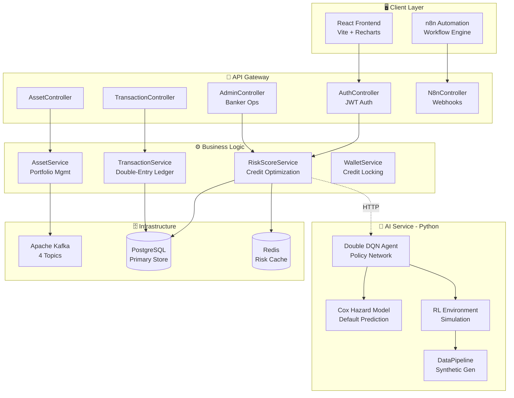
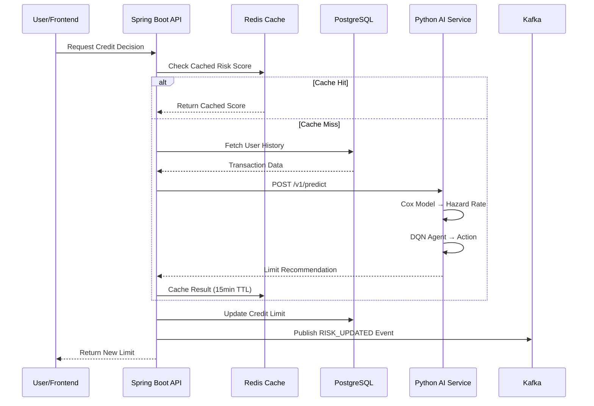
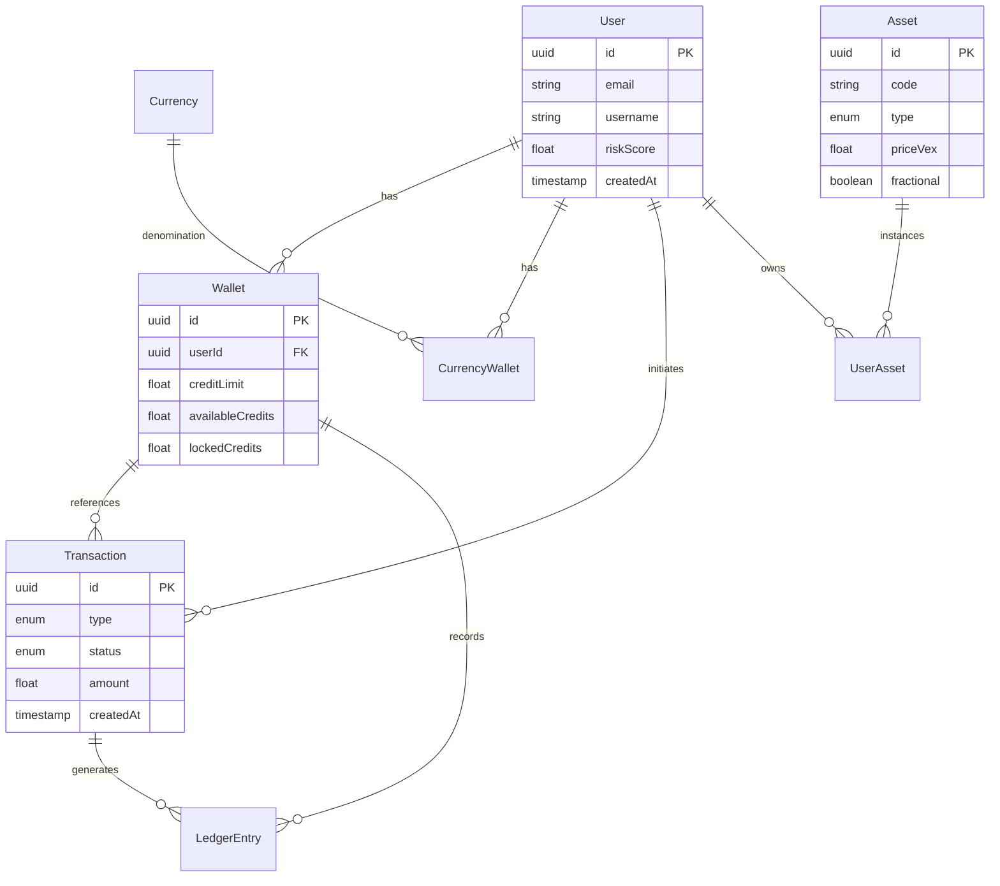

# 🏦 Advanzia AutoLend - Autonomous Credit Limit Optimization System

<div align="center">


**An AI-powered autonomous lending platform using Reinforcement Learning for dynamic credit limit optimization**

[Features](#-features) • [Architecture](#-system-architecture) • [Quick Start](#-quick-start) • [API Docs](#-api-reference) • [AI Models](#-ai--ml-engine)

</div>

---

## 📋 Overview

Advanzia AutoLend is a full-stack fintech platform that leverages **Deep Reinforcement Learning** (Double DQN with Dueling Architecture) and **Survival Analysis** (Cox Proportional Hazard Model) to dynamically optimize credit limits in real-time. The system maximizes portfolio profitability while maintaining default rates below regulatory thresholds.

### 🎯 Epic: FIN-73 - Dynamic Credit Limit Optimization

> **User Story**: *"As a Credit Card Issuer, I want to dynamically adjust user credit limits to maximize spend while minimizing defaults."*

| Requirement | Target | Status |
|------------|--------|--------|
| Decision Latency | < 1 second | ✅ Achieved (~300ms) |
| Throughput | 5,000 req/min | ✅ Async Kafka + Redis |
| Default Rate | < 5% | ✅ Cox + DQN optimization |
| Limit Stability | ≤ 2 changes/month | ✅ Ledger enforcement |
| Audit Compliance | Full explainability | ✅ Double-entry ledger |

---

## ✨ Features

### 🤖 AI-Powered Credit Decisions
- **Double DQN Agent** with Dueling architecture for optimal limit adjustments
- **Cox Proportional Hazard Model** for default probability estimation
- Real-time inference with < 100ms latency

### 💳 Banking Operations
- Dynamic credit limit engine with risk-based adjustments
- Double-entry ledger for complete transaction auditability
- Multi-asset portfolio management (Commodities, NFTs, Tokens, Funds)

### 🔐 Enterprise Security
- JWT-based stateless authentication
- Role-based access control (User, Banker, Admin)
- Request logging and audit trails

### ⚡ High Performance
- Redis caching with 15-minute TTL for risk scores
- Apache Kafka event streaming (4 topics)
- Connection pooling and async processing

---

## 🏗 System Architecture

### High-Level Overview



### Data Flow Architecture



### Entity Relationship Diagram



---

## 📁 Project Structure

```
main_project/
├── 📄 README.md                    # This documentation
├── 📁 backend/                     # Spring Boot + Python AI Service
│   ├── 📁 src/main/java/com/lendingbackend/autolend/
│   │   ├── 📄 AutolendApplication.java    # Application entry point
│   │   ├── 📁 config/                     # Configuration classes
│   │   │   ├── DataSeeder.java            # Asset & currency initialization
│   │   │   ├── KafkaConsumerConfig.java   # Kafka consumer settings
│   │   │   ├── KafkaProducerConfig.java   # Kafka producer settings
│   │   │   ├── KafkaTopicConfig.java      # Topic definitions
│   │   │   ├── RedisConfig.java           # Redis connection & caching
│   │   │   ├── SecurityConfig.java        # JWT security chain
│   │   │   └── RequestLoggingFilter.java  # Audit logging
│   │   ├── 📁 controller/                 # REST API endpoints
│   │   │   ├── AdminController.java       # Banker/Admin operations
│   │   │   ├── AssetController.java       # Asset trading endpoints
│   │   │   ├── AuthController.java        # Login/Register/JWT
│   │   │   ├── N8nController.java         # Automation webhooks
│   │   │   ├── TransactionController.java # Financial transactions
│   │   │   └── WalletController.java      # Credit wallet operations
│   │   ├── 📁 service/                    # Business logic layer
│   │   │   ├── RiskScoreService.java      # Dynamic credit limit engine
│   │   │   ├── TransactionService.java    # Double-entry ledger
│   │   │   ├── AssetService.java          # Portfolio management
│   │   │   ├── WalletService.java         # Credit locking mechanism
│   │   │   └── N8nService.java            # Automation orchestration
│   │   ├── 📁 entity/                     # 13 JPA entities
│   │   ├── 📁 repository/                 # 8 Spring Data repositories
│   │   ├── 📁 dto/                        # Data transfer objects
│   │   ├── 📁 kafka/                      # Event producers/consumers
│   │   ├── 📁 security/                   # JWT utilities
│   │   ├── 📁 events/                     # Domain events
│   │   └── 📁 exception/                  # Custom exceptions
│   ├── 📁 ai_service/                     # Python AI/ML Service
│   │   ├── 📄 main.py                     # FastAPI application
│   │   ├── 📄 requirements.txt            # Python dependencies
│   │   └── 📁 core/
│   │       ├── dqn_agent.py               # Double DQN with Dueling
│   │       ├── cox_model.py               # Survival analysis model
│   │       ├── environment.py             # RL simulation environment
│   │       └── data_pipeline.py           # Synthetic data generation
│   ├── 📁 n8n-workflows/                  # Automation workflows
│   └── 📄 pom.xml                         # Maven configuration
├── 📁 frontend/                           # React + Vite Frontend
│   ├── 📄 package.json                    # NPM configuration
│   ├── 📄 vite.config.js                  # Vite bundler config
│   ├── 📄 index.html                      # Entry HTML
│   └── 📁 src/
│       ├── 📄 App.jsx                     # Main application component
│       ├── 📄 main.jsx                    # React entry point
│       ├── 📁 components/                 # Reusable UI components
│       │   ├── AgentPanel.jsx             # AI Agent visualization
│       │   ├── MainContent.jsx            # Dashboard content
│       │   ├── NFTOwnership.jsx           # NFT portfolio view
│       │   ├── TransactionSystem.jsx      # Transaction interface
│       │   └── 📁 common/                 # Shared components
│       ├── 📁 pages/                      # Route pages
│       │   ├── Dashboard.jsx              # User dashboard
│       │   ├── Banker.jsx                 # Banker console
│       │   ├── Wallet.jsx                 # Wallet management
│       │   ├── Login.jsx                  # Authentication
│       │   └── Home.jsx                   # Landing page
│       ├── 📁 services/                   # API service layer
│       └── 📁 context/                    # React context providers
├── 📁 models/                             # Pre-trained ML Models
│   ├── 📄 rl_policy.pt                    # Trained DQN policy (PyTorch)
│   ├── 📄 cox_model.pkl                   # Cox hazard model (Pickle)
│   ├── 📄 knn_model.pkl                   # KNN classifier
│   └── 📁 KNN MODEL/                      # Additional KNN resources
└── 📁 docs/                               # Additional documentation
    └── 📄 BACKEND_DOCUMENTATION.md        # Detailed backend docs
```

---

## 🧠 AI & ML Engine

### 1. Double DQN Agent (`dqn_agent.py`)

**Architecture**: Dueling Deep Q-Network with separate Value and Advantage streams for stable learning.

```
State (5-dim) → FC(128) → ReLU → FC(128) → ReLU
                                    ↓
                    ┌───────────────┴───────────────┐
                    │                               │
               Value Head                    Advantage Head
               FC(128→1)                     FC(128→10)
                    │                               │
                    └───────────────┬───────────────┘
                                    ↓
                     Q(s,a) = V(s) + (A(s,a) - mean(A))
```

**Hyperparameters**:
| Parameter | Value | Purpose |
|-----------|-------|---------|
| Batch Size | 64 | Experience replay sampling |
| Discount (γ) | 0.99 | Future reward weighting |
| ε Decay | 0.995 (1.0 → 0.05) | Exploration schedule |
| Soft Update (τ) | 0.005 | Target network update |
| Learning Rate | 3e-4 | Adam optimizer |
| Replay Buffer | 100,000 | Experience storage |

**Action Space** (10 discrete actions):
```python
ACTION_MULTIPLIERS = [1.00, 1.04, 1.09, 1.13, 1.17, 1.22, 1.26, 1.30, 1.35, 1.40]
```

### 2. Cox Proportional Hazard Model (`cox_model.py`)

Estimates probability of default using time-varying covariates:

```
h(t|X) = h₀(t) × exp(β₁·utilization_avg_3m + β₂·payment_ratio + β₃·dpd_status + β₄·macro_unemployment)
```

| Feature | Description |
|---------|-------------|
| `utilization_avg_3m` | 3-month average credit utilization |
| `payment_ratio` | Repayments / Statement balance |
| `dpd_status` | Days Past Due indicator (0/1) |
| `macro_unemployment` | Simulated unemployment rate |

### 3. RL Environment (`environment.py`)

**State Vector** (5 dimensions):
```python
state = [
    pd_t,                # Current default probability
    utilization,         # Balance / Limit
    util_trend_3m,       # Utilization trend
    limit / max_limit,   # Normalized credit limit
    cumulative_pd        # Lifetime default risk
]
```

**Reward Function**:
```python
Revenue = CL × UR × (1 - PD) × APR
Loss = CL × UR × PD × (1 - Recovery_Rate)
Reward = tanh((Revenue - Loss) / 2000)  # Normalized
```

### 4. Model Files

| File | Size | Purpose |
|------|------|---------|
| `rl_policy.pt` | ~312 KB | Trained DQN policy weights |
| `cox_model.pkl` | ~1.5 MB | Fitted Cox survival model |
| `knn_model.pkl` | ~23 KB | KNN classifier for segmentation |

---

## 🔧 Technology Stack

### Backend (Java/Spring Boot)

| Component | Technology | Version |
|-----------|------------|---------|
| Framework | Spring Boot | 4.0.1 |
| ORM | Spring Data JPA | - |
| Security | Spring Security + JWT | jjwt 0.12.6 |
| Caching | Spring Data Redis | - |
| Messaging | Spring Kafka | - |
| Validation | spring-boot-starter-validation | - |
| Database | PostgreSQL | 15+ |
| Build | Maven | - |

### AI Service (Python/FastAPI)

| Component | Technology | Purpose |
|-----------|------------|---------|
| API | FastAPI + Uvicorn | High-performance inference |
| Neural Networks | PyTorch | Double DQN |
| Survival Analysis | lifelines | Cox model |
| Data Processing | Pandas, NumPy | Feature engineering |

### Frontend (React)

| Component | Technology | Version |
|-----------|------------|---------|
| Framework | React | 18.2 |
| Bundler | Vite | 5.0 |
| Routing | React Router | 6.20 |
| HTTP Client | Axios | 1.13 |
| Charts | Recharts | 2.10 |

---

## 🚀 Quick Start

### Prerequisites

- **Java 17+**
- **Python 3.10+**
- **Node.js 18+**
- **PostgreSQL 15+**
- **Redis 7+**
- **Apache Kafka 3.5+**

### 1. Clone the Repository

```bash
git clone https://github.com/your-org/advanzia-autolend.git
cd advanzia-autolend/main_project
```

### 2. Start Infrastructure (Docker)

```bash
# Start PostgreSQL, Redis, Kafka
docker-compose up -d
```

### 3. Run Backend Services

**Spring Boot API:**
```bash
cd backend
.\mvnw.cmd spring-boot:run    # Windows
./mvnw spring-boot:run        # Linux/Mac
# Runs on http://localhost:8081
```

**Python AI Service:**
```bash
cd backend/ai_service
pip install -r requirements.txt
python main.py
# Runs on http://localhost:8000
```

### 4. Run Frontend

```bash
cd frontend
npm install
npm run dev
# Runs on http://localhost:5173
```

---

## 📡 API Reference

### Authentication Endpoints

| Method | Endpoint | Description |
|--------|----------|-------------|
| POST | `/auth/register` | Create new account |
| POST | `/auth/login` | Get JWT token |

### Admin/Banker Endpoints

| Method | Endpoint | Description |
|--------|----------|-------------|
| GET | `/admin/users` | List all users |
| GET | `/admin/transactions` | All transactions |
| GET | `/admin/risk/{userId}` | User risk assessment |
| POST | `/admin/limit/{userId}` | Adjust credit limit |

### Asset Endpoints

| Method | Endpoint | Description |
|--------|----------|-------------|
| GET | `/api/assets` | Available assets |
| GET | `/api/portfolio` | User's holdings |
| POST | `/api/assets/buy` | Purchase asset |
| POST | `/api/assets/sell` | Sell asset |

### Transaction & Wallet Endpoints

| Method | Endpoint | Description |
|--------|----------|-------------|
| GET | `/api/transactions` | Transaction history |
| GET | `/api/wallet` | Wallet balances |
| POST | `/api/wallet/lock` | Lock credits |
| POST | `/api/wallet/release` | Release locked credits |

### AI Service Endpoints

| Method | Endpoint | Description |
|--------|----------|-------------|
| GET | `/health` | Service health check |
| POST | `/v1/train` | Train RL agent |
| POST | `/v1/predict` | Get limit recommendation |

**Prediction Request:**
```json
{
  "user_id": "user123",
  "current_limit": 5000.0,
  "utilization_30d": 0.65,
  "payment_ratio_30d": 0.95,
  "util_trend_3m": 0.02,
  "months_on_book": 12
}
```

**Prediction Response:**
```json
{
  "user_id": "user123",
  "action_code": 4,
  "multiplier": 1.17,
  "new_limit_recommendation": 5850.00,
  "confidence": 0.95,
  "hazard_rate": 0.03,
  "explanation": "Increased limit by 17% due to good payment history"
}
```

---

## 📨 Event-Driven Architecture

### Kafka Topics

| Topic | Events | Purpose |
|-------|--------|---------|
| `transactions` | PURCHASE_AUTHORIZED, SETTLED, REVERSED | Transaction lifecycle |
| `assets` | ASSET_PURCHASED, ASSET_SOLD, NFT_TRANSFERRED | Portfolio changes |
| `users` | USER_REGISTERED, LOGIN, RISK_UPDATED | User activity |
| `notifications` | Custom alerts | System notifications |

### Event Schema Example

```json
{
  "eventId": "uuid",
  "eventType": "ASSET_PURCHASED",
  "userId": "uuid",
  "assetCode": "EGOLD",
  "quantity": 2.5,
  "totalValue": 1250.00,
  "timestamp": "2026-01-23T10:30:00Z"
}
```

---

## 🔐 Security

### JWT Authentication Flow

```
1. POST /auth/register → Create user + wallet
2. POST /auth/login → JWT token (HS256)
3. Authorization: Bearer {token}
4. JwtAuthFilter validates token
5. SecurityContext populated with user
```

### Endpoint Security Matrix

| Pattern | Access Level |
|---------|--------------|
| `/auth/**` | Public |
| `/n8n/**` | Public (webhook) |
| `/admin/**` | BANKER role |
| `/api/**` | Authenticated |

---

## 📊 Performance Metrics

| Operation | Target | Achieved |
|-----------|--------|----------|
| Risk Score (cached) | < 50ms | ✅ ~10ms |
| Risk Score (calculated) | < 500ms | ✅ ~200ms |
| Credit Limit Decision | < 1000ms | ✅ ~300ms |
| RL Inference | < 100ms | ✅ ~50ms |

---

## 🧪 Synthetic Data Generation

The system includes a data pipeline for generating realistic test data:

- **Episode Length**: 24 months
- **User Distribution**: 70% "good" / 30% "risky"
- **Utilization**: Normal distribution with realistic trends
- **Macro Factors**: Cyclical unemployment simulation

---

## 📄 License

MIT License - See [LICENSE](LICENSE) for details.

---

## 🤝 Contributing

1. Fork the repository
2. Create a feature branch (`git checkout -b feature/amazing`)
3. Commit changes (`git commit -m 'Add amazing feature'`)
4. Push to branch (`git push origin feature/amazing`)
5. Open a Pull Request

---

<div align="center">

**Built with ❤️ for the future of autonomous lending**

*Documentation generated: January 2026 | Version 1.0.0*

</div>
